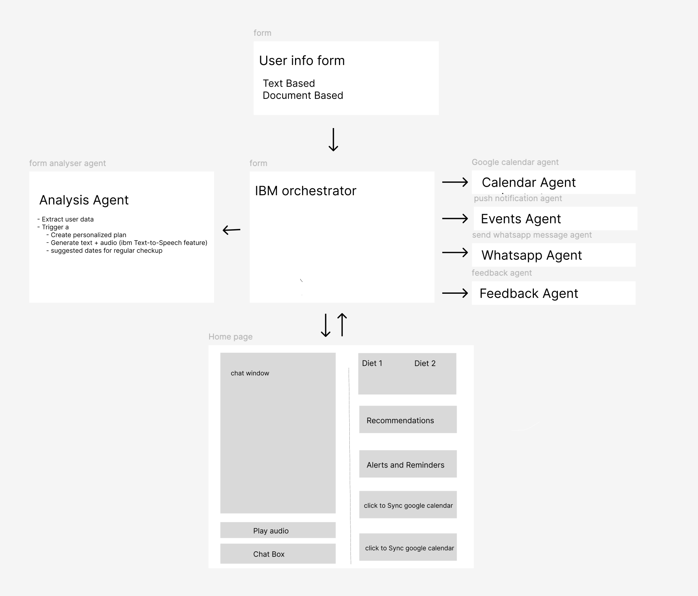

# Health AI Assistant

An intelligent health management system powered by IBM Watson that provides personalized dietary recommendations, calendar scheduling, and multi-channel notifications for patients.

## Overview

Health AI Assistant is an accessibility-first application that helps users manage their health through AI-powered dietary analysis and recommendations. The system features voice output for visually impaired users and seamless integration with popular platforms like Google Calendar, WhatsApp, and Slack.

## Architecture

## API Endpoints
